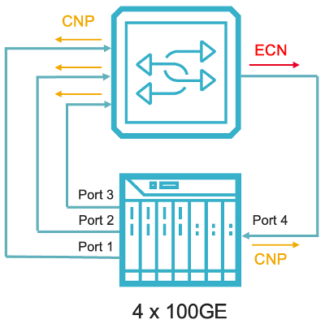

## RoCEv2 Congestion Control
This test exercise switch buffer management capability and validates it can effectively prevent dropping data traffic using RoCEv2 congestion notification and rate control method at per Q-Pair level, before kick in PFC to throttling traffic for the entire port. This should be validated with different traffic patterns commonly used for AI/ML training. In this test, we use N:1 incast traffic pattern. 

### Test setup: 
The testbed consists of 4x100GE Tester ports connecting to RoCEv2 enabled switch. Traffic is sent from 3 Tx test ports to 1 Rx test ports. This creates congestion at switch’s egress port, hence triggers ECN marking to notify the congestion.  

### Steps: 
* Configure port 1~3 as initiator ports and port 4 as responder port. Configure 1 Q-Pair from each initiator port to the responder port. This creates 3 Q-Pairs at port 4. 
* Establish 3 Q-Pair connections from port 1~3 to port 4
* Generate RDMA traffic (simulating RDMA Write) with DSCP value 3 (lossless priority) and buffer size 1M. Each initiator port is setup to transmit traffic at 40% of line rate 
* At switch side, configures PFC threshold for ingress buffer, configure the threshold of ingress buffer higher than egress buffer. This ensures that switch kick in ECN marking at egress early to avoid traffic drop. 
* Start traffic. This will create congestion at switch egress port 

 Expected results: 
* At tester port 4, check traffic throughput and RoCEv2 statistic. Upon congestion, switch will send Explicit Congestion Notification (ECN bits set to 11).
* At tester port 4, Rx ECN and Tx CNP counter should increment. This indicates that switch mark ECN to notify congestion. The Q-Pair endpoint at port 4 generates CNP to notify the initiator. Tx CNP counter should be equal or less than Rx ECN counter
* Switch forwards CNP towards initiator. Upon receiving CNP, DCQCN rate control kicks in. The initiator port reduces traffic rate per DCQCN algorithm. This should alleviate the congestion at switch and the rate will reach to steady state
* Check the RoCE statistics for RDMA Write completion, traffic throughput and min/max/avg latency per Q-Pair  
* The switch should NOT send PFC (pause frame) if ECN/CNP can control the rate and prevent egress port to get into congestion state. 

