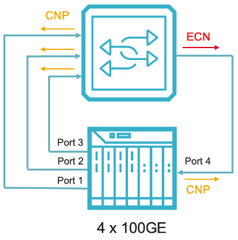
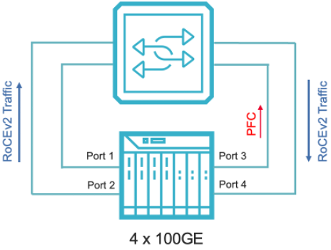

This document describes test consideration for validating RoCEv2 congestion control implementing of switch and switch fabric in order to support lossless Ethernet for AI/ML use cases. 

# Background
The large AI model training involves many compute nodes of Servers with GPUs doing parallel computing and requires collective communication operations among many devices. The network connecting these devices need to provide high bandwidth throughput, lossless traffic, balanced latency between a pair of devices, reduce tail latency of worst case, and fast convergence during failure. 
The AI training network design can be 2-tiers or 3-tiers depends on required scale and design choice. Care needs to be taken for ECMP hashing, PFC deadlock and end-to-end communication latency. To validate the effectiveness of network fabric for large AI training network, switch fabric needs to exercise RoCE Congestion Control and Priority Flow Control and optimize buffer management for AI/ML workload. 
Below shows a scaled down 2-tier switch fabric with 4 leaf switches and 2 spine switches. Test consideration includes validating individual switch, as well as switch fabric. For simplicity, we start with testing individual switch for buffer management and PFC handling. The test methodology can be expanded to test switch fabric efficiency of forwarding AI/ML workload.

## RoCEv2 Congestion Control
This test exercise switch buffer management capability and validates it can effectively prevent dropping data traffic using RoCEv2 congestion notification and rate control method at per Q-Pair level, before kick in PFC to throttling traffic for the entire port. This should be validated with different traffic patterns commonly used for AI/ML training. In this test, we use N:1 incast traffic pattern. 

### Test setup: 
The testbed consists of 4x100GE Tester ports connecting to RoCEv2 enabled switch. Traffic is sent from 3 Tx test ports to 1 Rx test ports. This creates congestion at switch’s egress port, hence triggers ECN marking to notify the congestion.  

### Steps: 
* Configure port 1~3 as initiator ports and port 4 as responder port. Configure 1 Q-Pair from each initiator port to the responder port. This creates 3 Q-Pairs at port 4. 
* Establish 3 Q-Pair connections from port 1~3 to port 4
* Generate RDMA traffic (simulating RDMA Write) with DSCP value 3 (lossless priority) and buffer size 1M. Each initiator port is setup to transmit traffic at 40% of line rate 
* At switch side, configures PFC threshold for ingress buffer, configure the threshold of ingress buffer higher than egress buffer. This ensures that switch kick in ECN marking at egress early to avoid traffic drop. 
* Start traffic. This will create congestion at switch egress port 

 Expected results: 
* At tester port 4, check traffic throughput and RoCEv2 statistic. Upon congestion, switch will send Explicit Congestion Notification (ECN bits set to 11).
* At tester port 4, Rx ECN and Tx CNP counter should increment. This indicates that switch mark ECN to notify congestion. The Q-Pair endpoint at port 4 generates CNP to notify the initiator. Tx CNP counter should be equal or less than Rx ECN counter
* Switch forwards CNP towards initiator. Upon receiving CNP, DCQCN rate control kicks in. The initiator port reduces traffic rate per DCQCN algorithm. This should alleviate the congestion at switch and the rate will reach to steady state
* Check the RoCE statistics for RDMA Write completion, traffic throughput and min/max/avg latency per Q-Pair  
* The switch should NOT send PFC (pause frame) if ECN/CNP can control the rate and prevent egress port to get into congestion state. 

## Priority Flow Control (PFC) 
This test exercise switch PFC implementation for traffic throttling when receive PFC pause, and resume normal transmission after the situation is alleviated. This could happen in AI/ML training network when Server/NIC runs into resource bottleneck. PFC is the last barrier for preventing traffic loss when ECN/CNP congestion control failed to prevent loss. 
Test setup:
The testbed consists of 4x100GE Tester ports forming 2 port pairs. RoCEv2 traffic is sent between both port pairs. When PFC Pause is received for a PFC queue on switch port, it should only impact the traffic mapped to that PFC queue.

 
      
Steps: 
* Configure Port 1 & 2 as initiator ports, port 3 & 4 as responder ports. Configure 2 Q-Pairs from each initiator port to the corresponding responder port.
* At Port 1, generate RDMA traffic (simulate RDMA Write) with buffer size 1M. Configure DSCP priority 3 for Q-Pair 1 and DSCP priority 4 for Q-Pair 2. DSCP value 3 & 4 are lossless priority
* At Port 2, generate RDMA traffic (simulate RDMA Write) with buffer size as 1M. Configure DSCP priority 3 for Q-Pair 3 and DSCP priority 4 for Q-Pair 4. 
* Each Q-Pair is setup to transmit at 45% of line rate and each initiator port sends total 90% line rate traffic. 
* Generate continue PFC Pause frames with priority 3 (map to DSCP value 3) and max Quanta (65535) 
* At switch side, configures 2 PFC queues and map them to DSCP priority 3 & 4 respectively.
* Start RoCEv2 traffic. Switch forwards the traffic to egress ports. Observe traffic throughput and latency per Q-Pair and per port.
* At port 3, start PFC pause frames to block traffic for DSCP priority 3. Observe traffic throughput and latency per Q-Pair and per port. 
* At port 3, send a X-off PFC pause frame (Quanta 0). Switch should resume forwarding traffic.
   Expected results: 
* Check traffic throughput per Q-Pair and per port. There should be no loss.
* Both Q-Pairs on same port pair should show similar average latency. There should be no abnormal latency (eg. One Q-Pair has much higher latency compare with the other one). 
* At port 3, upon sending pause frame for DSCP priority 3, Rx traffic is paused. Upon sending X-off Pause frame, traffic is then resumed to normal throughput. Check latency for Q-Pair 1, it should show increase of latency due to PFC throttling. There maybe loss if switch buffer overflow during pause period.
* At port 3, check throughput and latency of Q-Pair 2. Both should not be impacted. 
* At port 4, check throughput and latency of Q-Pair 3 and Q-Pair 4. Both should not be impacted. 

